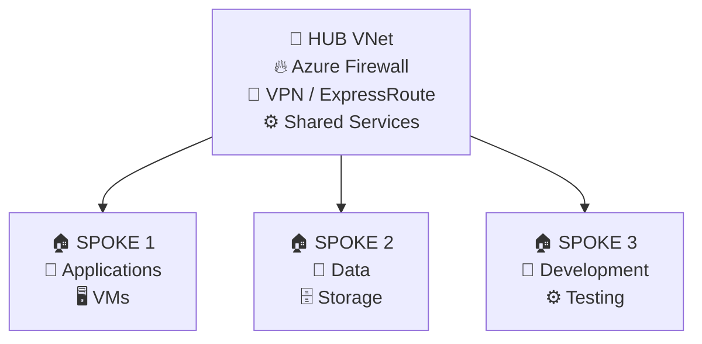

# ☁️ AJITPAL JOON

### 🚀 Cloud & DevOps Engineer | Microsoft Azure | Terraform | CI/CD

<p align="center">


</p>

<p align="center">

<a href="https://github.com/ajitpaljoon-devops">

</a>

<a href="https://github.com/ajitpaljoon-devops">

</a>

</p>

---

## 👋 About Me

I'm a **Cloud & DevOps Engineer** focused on designing, deploying and automating secure and scalable cloud infrastructure.

My primary expertise is in **Microsoft Azure, Terraform, Git, GitHub, CI/CD and Cloud Networking**.

I enjoy transforming manual infrastructure and deployment processes into **automated, repeatable and reliable solutions** using Infrastructure as Code and DevOps practices.

### 🎯 What I Focus On

- ☁️ Microsoft Azure Infrastructure
- 🏗️ Infrastructure as Code with Terraform
- 🔄 CI/CD Automation
- 🌐 Azure Cloud Networking
- 🔐 Cloud Security & Access Management
- 📈 Scalability & High Availability
- 🤖 Infrastructure Automation
- 🐳 Containers & Kubernetes
- 🛡️ DevSecOps practices

---

## 🧰 Technical Skills

### ☁️ Cloud — Microsoft Azure


`Virtual Machines` `VNet` `Subnet` `NSG` `ASG`

`Load Balancer` `Application Gateway` `Storage Account`

`Azure Firewall` `VPN Gateway` `ExpressRoute`

`Private Endpoint` `DNS` `Azure Monitor`

`Microsoft Entra ID` `RBAC` `Azure Policy`

`Resource Locks` `Landing Zone`

---

### 🏗️ Infrastructure as Code


`Terraform` `Terraform Modules` `Variables`

`tfvars` `Data Sources` `for_each`

`count` `locals` `outputs`

`Remote State` `State Locking`

`Terraform Plan` `Terraform Apply`

`Infrastructure Automation`

---

### 🔄 DevOps & CI/CD


`Git` `GitHub` `GitHub Actions`

`Azure DevOps` `CI/CD`

`Build` `Test` `Deploy`

`Infrastructure Pipeline`

---

### 🐳 Containers & Orchestration


`Docker` `Docker Images` `Containers`

`Kubernetes` `Pods` `Deployments`

---

### 🌐 Networking

`VNet` `Subnet` `VNet Peering`

`Hub & Spoke Architecture`

`NSG` `ASG` `Load Balancing`

`Application Gateway`

`Azure Firewall`

`VPN Gateway` `ExpressRoute`

`DNS` `Private Connectivity`

---

### 🐧 Operating Systems


`Linux` `Ubuntu` `Windows Server`

---

# 🚀 Featured Projects

## 🏗️ Azure Infrastructure Automation with Terraform

Designed and automated Azure infrastructure using **reusable Terraform modules**.

### Infrastructure Components

- ☁️ Resource Groups
- 🌐 Virtual Networks
- 🔹 Subnets
- 🔐 Network Security Groups
- 🛡️ Application Security Groups
- 🌍 Public IPs
- 🖥️ Virtual Machines
- 🔗 VNet Peering
- 💾 Storage Accounts

### Key Concepts

`Infrastructure as Code`

`Reusable Modules`

`Variables & tfvars`

`for_each`

`Data Sources`

`Terraform State`

---

## ☁️ Azure Hub & Spoke Architecture

Designed a scalable and secure Azure network architecture using the **Hub & Spoke model**.

### Architecture



## 🔄 CI/CD Pipeline Automation

Designed a CI/CD workflow to automate application and infrastructure deployment using GitHub Actions and Terraform.

### 🚀 Pipeline Workflow

```text
Code Push
    ↓
GitHub Repository
    ↓
GitHub Actions
    ↓
Build & Validate
    ↓
Terraform Init
    ↓
Terraform Plan
    ↓
Terraform Apply
    ↓
Azure Infrastructure
```

### 🛠️ Technologies

`Git` `GitHub` `GitHub Actions` `Terraform` `Microsoft Azure`

---

## 📊 GitHub Stats

<p align="center">


</p>

---

## 🐍 Contribution Snake

<p align="center">


</p>

---

## 🤝 Let's Connect

<p align="center">

<a href="https://www.linkedin.com/in/ajit-pal-82560621">

</a>

<a href="https://github.com/ajitpaljoon-devops">

</a>

<a href="mailto:ajitpal.joon@gmail.com">

</a>

</p>

---

### 🚀 Keep Learning • Keep Automating • Keep Building

> **"Automate Everything. Build Smart. Deploy Faster."** ☁️🚀

⭐ If you find my repositories useful, consider giving them a **star**!
